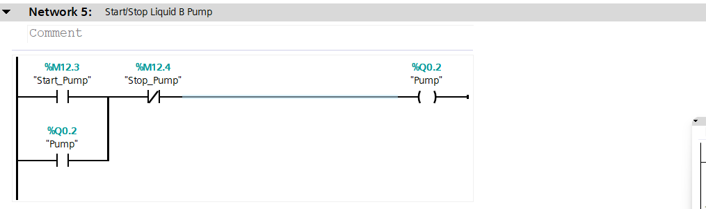
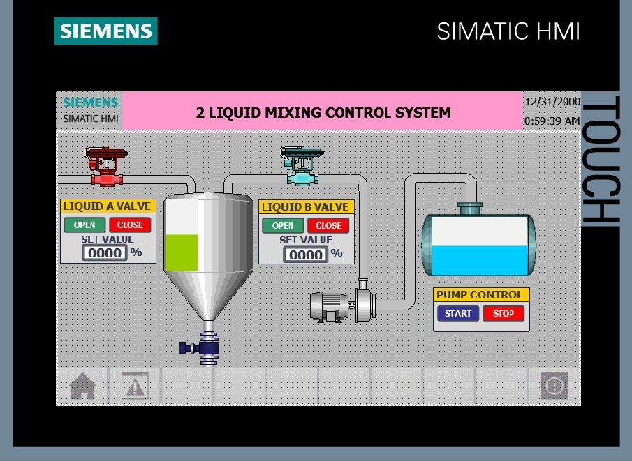

# Automated 2 Liquid Mixing Control System — PLC S7-1200, HMI TP700 Comfort (TIA Portal V20)

This project demonstrates an industrial mixing automation system using Siemens PLC S7-1200, Analog Input/Output, PLC SIM, and an HMI (TP700 Comfort).
The system includes motor control, level simulation, analog processing, and full SCADA/HMI visualization.

## 🔧 Features

PLC S7-1200 logic using Ladder Diagram

Analog Input (AI) and Analog Output (AO) simulation

Motor start/stop control with interlocks

Mixing process logic

Integrated HMI using TP700 Comfort

Full simulation using PLCSIM

SCADA-style monitoring

## 🏗️ Project Architecture
PLC S7-1200  →  Analog Modules  →  PLCSIM  
      ↓
HMI TP700 Comfort  →  Process Monitoring & Control

## 🧩 How It Works
1. Analog Input Simulation

Simulated using PLCSIM

Represents tank level / sensor signal

Scaled to engineering values

2. Mixing Control Logic

Start button activates motor

Interlock prevents accidental restart

Automatic stop based on:

Timer

Level threshold (analog)

3. HMI Visualization

Real-time display of level

Motor status indicator

Start/Stop controls

Alarm display

Trend graph for analog values

## 🛠️ Tools Used

Siemens TIA Portal V20

TP700 (Comfort) HMI

PLCSIM

## 📚 Topics Covered

PLC Ladder programming

Analog scaling & processing

GUI/HMI design

Industrial automation workflow

Industry 4.0 mindset

## 📸 Screenshots

## Ladder logic

### Network 1 & 2 – Mixer Tank Level Measurement & Liquid A Level Measurement

### Network 3 – Valve A Control (Analog 4-20mA)

### Network 4 – Valve B Control (Analog 4-20mA)

### Network 5 – Liquid B Pump Start/Stop

## HMI main screen

👤 Author

Hilmi Dzakiana Maulidia
hilmi14dzakiana@gmail.com
