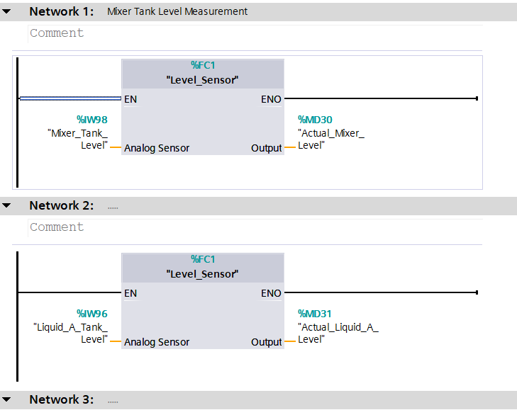

## Automated Mixing Control System — PLC S7-1200, Analog I/O, SCADA (TIA Portal V17)

This project demonstrates an industrial mixing automation system using Siemens PLC S7-1200, Analog Input/Output, PLC SIM, and an HMI (KTP700).
The system includes motor control, level simulation, analog processing, and full SCADA/HMI visualization.

🔧 Features

PLC S7-1200 logic using Ladder Diagram

Analog Input (AI) and Analog Output (AO) simulation

Motor start/stop control with interlocks

Mixing process logic (timer-based or analog-triggered)

Integrated HMI using KTP700 Basic/Comfort

Full simulation using PLCSIM

SCADA-style monitoring (status, alarms, trends)

🏗️ Project Architecture
PLC S7-1200  →  Analog Modules  →  PLCSIM  
      ↓
HMI KTP700  →  Process Monitoring & Control

📁 Repository Structure
📦 Automated-Mixing-Control-System
│
├── /src
│    ├── /PLC
│    │      └── PLC_S7-1200_Mixing.ap17
│    ├── /HMI
│    │      └── HMI_KTP700.ap17
│    └── /Screenshots
│           ├── Ladder_Main.png
│           ├── Ladder_AnalogProcessing.png
│           ├── Ladder_Interlock.png
│           ├── HMI_MainScreen.png
│           └── HMI_TrendScreen.png
│
├── /docs
│    ├── IO_List.pdf
│    ├── Block_Diagram.png
│    └── System_Description.pdf
│
└── README.md

Note: Upload screenshots of your ladder diagram so viewers can understand the logic without opening TIA Portal.

🧩 How It Works
1. Analog Input Simulation

Simulated using PLCSIM

Represents tank level / sensor signal

Scaled to engineering values

2. Mixing Control Logic

Start button activates motor

Interlock prevents accidental restart

Automatic stop based on:

Timer

Level threshold (analog)

3. HMI Visualization

Real-time display of level

Motor status indicator

Start/Stop controls

Alarm display

Trend graph for analog values

🚀 How to Run the Project

Open TIA Portal V17

Load the PLC project (/src/PLC/)

Start PLCSIM

Download program to the simulated CPU

Open HMI project (/src/HMI/)

Run HMI simulation

Start the mixing process from the HMI or from PLC inputs

🛠️ Tools Used

Siemens TIA Portal V17

Siemens S7-1200 CPU

KTP700 (Basic/Comfort) HMI

PLCSIM (for full emulation)

📚 Topics Covered

PLC Ladder programming

Analog scaling & processing

GUI/HMI design

Industrial automation workflow

SCADA concepts

Industry 4.0 mindset

📸 Screenshots

Add screenshots in /src/Screenshots:

Ladder logic

### Network 1 & 2 – Mixer Tank Level Measurement & Liquid A Level Measurement

### Network 3 – Valve A Control (Analog 4-20mA)

### Network 4 – Valve B Control (Analog 4-20mA)

### Network 5 – Liquid B Pump Start/Stop

HMI main screen

Trend page

Alarm page

(You can just drag & drop them into the GitHub README afterward.)

👤 Author

Your Name
Automation Engineer | PLC | SCADA | Industrial Control Systems
